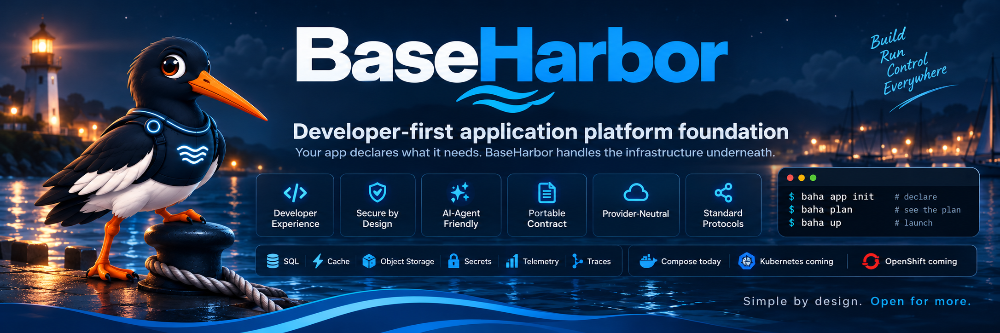

<p align="center">
  
</p>

<h2 align="center">One application contract. Replaceable infrastructure.</h2>

<p align="center">
  <a href="https://github.com/mcpdev80/baseharbor/actions/workflows/release.yml">
    
  </a>
  <a href="https://github.com/mcpdev80/baseharbor/releases">
    
  </a>
  <a href="https://mcpdev80.github.io/baseharbor/">
    
  </a>
  <a href="LICENSE">
    
  </a>
</p>

**Inspect existing repositories**  
Discover infrastructure requirements from code, dependencies, Compose files, ports and configuration.

**Declare needs, not products**  
Keep infrastructure intent portable instead of coupling the app to a specific implementation.

**Use standard interfaces**  
PostgreSQL · Redis/Valkey · S3 · HTTP · OTLP · environment variables · files

**Zero-trust by default**  
Least privilege · scoped credentials · explicit trust boundaries · fail-closed behavior

**Built for humans and AI agents**  
Structured, secret-safe JSON · bounded MCP · no generic shell · no Docker access

```bash
baha app inspect .
baha app init
baha plan
baha up -e dev
baha doctor -e dev
```

> **Runtime status:** Docker uses Docker Compose. Podman translates the same Compose-based workload/runtime definitions into native Quadlets managed through rootless `systemd --user`; `podman-compose` is not required. Kubernetes and OpenShift are planned runtime providers and are not implemented yet.

## Why BaseHarbor?

Modern applications depend on databases, caches, secrets, object storage, networking and observability. BaseHarbor keeps those requirements in one application contract while the infrastructure underneath stays replaceable.

```text
Application
    |
    v
baseharbor.yaml
    |
    v
BaseHarbor
    |
    +--> capabilities
    +--> providers
    +--> policy + security
    +--> lifecycle
    |
    v
Docker Compose / Podman Quadlet today
Kubernetes / OpenShift planned
```

## What you get

- Repository inspection with **Detected / Suggested / Possible** evidence.
- Portable application intent with provider-neutral capability boundaries.
- PostgreSQL, Valkey/Redis, S3, secrets, HTTP exposure, metrics, logs, traces and OTLP.
- Plan, preflight, policy, apply, verify, status and doctor from one CLI.
- Backup/restore, updates, runtime-created resources and explicit app-to-app connectivity.
- Provider placement for application-scoped, shared or externally managed infrastructure.
- Machine-readable results and a versioned local MCP interface for agent workflows.

## Security is behavior

BaseHarbor does not treat security as a label.

Current behavior includes:

- deny-by-default and fail-closed decisions;
- scoped application/runtime credentials;
- bucket-scoped S3 credentials;
- application-scoped runtime identities;
- explicit directional cross-application connectivity;
- protected deployment state;
- real protocol/data-flow readiness checks;
- workload preflight checks for risky Compose settings such as privileged mode, runtime sockets, host networking, dangerous capabilities, devices and critical host mounts.

## Application contract

The application describes **what it needs**, not how infrastructure must be implemented.

```yaml
version: 1

app:
  name: my-app
  environment: production

services:
  postgres:
    enabled: true

  redis:
    enabled: true

  object_storage:
    buckets:
      uploads: {}

secrets:
  required:
    - name: APP_SECRET
```

BaseHarbor exposes normal application-facing bindings such as:

```text
DATABASE_URL
REDIS_URL
VALKEY_URL
S3_ENDPOINT
S3_BUCKET
APP_SECRET
```

Your application keeps using native ecosystem clients and protocols.

## Agent-native, without giving the agent a shell

```bash
baha agent describe -o json
baha mcp serve
```

The local MCP interface exposes bounded BaseHarbor operations such as inspect, plan, status, doctor and policy checks. It does not expose a generic shell, Docker socket or unrestricted runtime execution.

## Install

```bash
curl -fsSL https://raw.githubusercontent.com/mcpdev80/baseharbor/main/scripts/install.sh | bash
baha version
```

## Learn more

- [Documentation home](docs/index.md)
- [Getting started](docs/tutorials/getting-started.md)
- [Architecture](docs/explanation/architecture.md)
- [Application contract](docs/explanation/application-contract.md)
- [Providers](docs/explanation/providers.md)
- [CLI reference](docs/reference/cli.md)
- [Normative specifications](docs/spec/README.md)
- [Roadmap](docs/roadmap.md)

## Project status

BaseHarbor is **pre-v1**. Manifest v1 is the current v0.4 compatibility surface.

Compose is the complete runtime implementation today. Kubernetes and OpenShift remain future runtime tracks and must preserve the same application contract when implemented.

Normal feature, fix, chore and dependency pull requests target `develop`. The `main` branch represents released source.

## License

Apache License 2.0. See [LICENSE](LICENSE).
