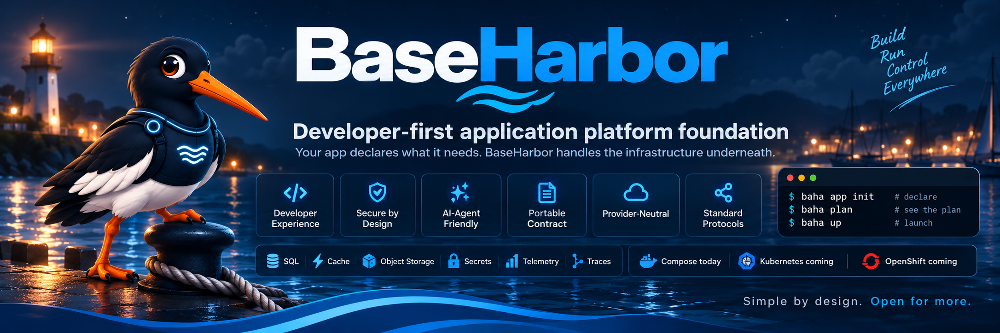

<p align="center">
  
</p>

<h2 align="center">One application contract. Replaceable infrastructure.</h2>

<p align="center"><strong>AI-generated, human-specified, machine-verified.</strong><br>
<em>KI-generiert, menschlich spezifiziert, maschinell verifiziert.</em></p>

<p align="center">
  <a href="https://github.com/mcpdev80/baseharbor-demo">
    
  </a>
  <a href="https://github.com/mcpdev80/baseharbor/releases">
    
  </a>
  <a href="https://mcpdev80.github.io/baseharbor/">
    
  </a>
  <a href="CONTRIBUTING.md">
    
  </a>
  <a href="LICENSE">
    
  </a>
</p>

**Inspect existing repositories**  
Discover infrastructure requirements from code, dependencies, Compose files, ports and configuration.

**Declare needs, not products**  
Keep infrastructure intent portable instead of coupling the app to a specific implementation.

**Use standard interfaces**  
PostgreSQL · Redis/Valkey · S3 · HTTP · OIDC/OAuth2 · OTLP · environment variables · files

**Zero-trust by default**  
Least privilege · scoped credentials · explicit trust boundaries · fail-closed behavior

**Built for humans and AI agents**  
Structured, secret-safe JSON · bounded MCP · no generic shell · no Docker access

**Explicit deployment destinations**  
Target + Application + Environment · target-scoped state · Docker/Podman today · Kubernetes/OpenShift later

```bash
baha app inspect .
baha app init
baha target
baha up
baha status
baha doctor
```

> **Runtime status:** Docker uses Docker Compose. Podman translates the same Compose-based workload/runtime definitions into native Quadlets managed through rootless `systemd --user`; `podman-compose` is not required. Kubernetes and OpenShift are planned runtime providers and are not implemented yet.

## Why BaseHarbor?

Modern applications depend on databases, caches, secrets, object storage, networking and observability. BaseHarbor keeps those requirements in one application contract while the infrastructure underneath stays replaceable.

```text
Application
    |
    v
baseharbor.yaml
    |
    v
BaseHarbor
    |
    +--> capabilities
    +--> providers
    +--> policy + security
    +--> lifecycle
    |
    v
Docker Compose / Podman Quadlet today
Kubernetes / OpenShift planned
```

## What you get

- Repository inspection with **Detected / Suggested / Possible** evidence.
- Portable application intent with provider-neutral capability boundaries.
- PostgreSQL, Valkey/Redis, S3, secrets, managed/external OIDC identity, HTTP exposure, metrics, logs, traces and OTLP.
- Optional provider management surfaces for pgAdmin, Redis Commander, SeaweedFS Admin, OpenBao, Keycloak and Prometheus.
- Canonical local development URLs through one Target-scoped domain (default `baha.localhost`) instead of exposing random loopback ports as normal developer UX.
- One Target-scoped development management login reused across selected local management surfaces; managed OIDC becomes the central development identity when Identity is present, with provider-native adapters only where required.
- Environment-aware operator access: trusted local operation in dev; authenticated OIDC operator access in test/prod.
- A canonical guided developer path: `baha app init` -> select/inspect Target -> `baha up` -> verified READY.
- First-class deployment Targets with XDG-backed configuration and target-scoped runtime/deployment state.
- Plan, preflight, policy and explicit apply remain available for automation and troubleshooting.
- Backup/restore, updates, runtime-created resources and explicit app-to-app connectivity.
- Provider placement for application-scoped, shared or externally managed infrastructure.
- Resource-efficient shared providers as the normal BaseHarbor model: one Target-owned provider can serve many applications while databases, cache resources, credentials, bindings and destroy ownership remain application-isolated.
- Machine-readable results and a versioned local MCP interface for agent workflows.

## Local development access

For `dev`, BaseHarbor keeps local access predictable without changing the portable application contract.

The effective Target owns one development domain, defaulting to `baha.localhost`. Browser-facing application and provider surfaces receive deterministic HTTPS names such as:

```text
my-app.baha.localhost
pgadmin.baha.localhost
auth.baha.localhost
secrets.baha.localhost
metrics.baha.localhost
```

The default reference placement is shared wherever the bundled provider can safely isolate applications. PostgreSQL uses one Target-owned provider with per-application databases and roles. Valkey uses one Target-owned provider lifecycle with isolated per-application cache resources. Dedicated `application` placement remains available when an isolated provider instance is explicitly required.

A Target-scoped development account defaults to username `developer` with a generated strong password. BaseHarbor reuses that identity across selected development management surfaces. When managed Identity is present, the same developer identity is reconciled through OIDC; providers that require native authentication receive an adapter using the same development credentials.

Use the explicit commands when you need to inspect or change local development access:

```bash
baha dev domain
baha dev domain dev.example.internal
baha dev credentials
baha dev credentials --reset
```

The password is never printed by normal `status`, `doctor`, plan or evidence output. Test and prod do not use this shared development credential; they keep the authenticated operator-OIDC boundary.

## Security is behavior

BaseHarbor does not treat security as a label.

Current behavior includes:

- deny-by-default and fail-closed decisions;
- scoped application/runtime credentials;
- bucket-scoped S3 credentials;
- application-scoped runtime identities;
- standard OIDC application identity with file-based trust material for managed/private issuers;
- authenticated BaseHarbor operator boundaries for test/prod, separate from application-user identity;
- explicit directional cross-application connectivity;
- protected deployment state;
- real protocol/data-flow readiness checks;
- workload preflight checks for risky Compose settings such as privileged mode, runtime sockets, host networking, dangerous capabilities, devices and critical host mounts.

## Application contract

The application describes **what it needs**, not how infrastructure must be implemented.

```yaml
version: 1

app:
  name: my-app
  environment: production

services:
  sql:
    enabled: true

  cache:
    enabled: true

  object_storage:
    buckets:
      uploads: {}

  identity:
    enabled: true

secrets:
  required:
    - name: APP_SECRET
```

BaseHarbor exposes normal application-facing bindings such as:

```text
DATABASE_URL
REDIS_URL
VALKEY_URL
S3_ENDPOINT
S3_BUCKET
OIDC_ISSUER
OIDC_CLIENT_ID
OIDC_CLIENT_SECRET_FILE
OIDC_CA_FILE
APP_SECRET
```

Your application keeps using native ecosystem clients and protocols.

## Agent-native, without giving the agent a shell

```bash
baha agent describe -o json
baha mcp serve
```

The local MCP interface exposes bounded BaseHarbor operations such as inspect, plan, status, doctor and policy checks. It does not expose a generic shell, Docker socket or unrestricted runtime execution.

## Install

```bash
curl -fsSL https://raw.githubusercontent.com/mcpdev80/baseharbor/main/scripts/install.sh | bash
baha version
```

## Learn more

- [Documentation home](docs/index.md)
- [Getting started](docs/tutorials/getting-started.md)
- [Architecture](docs/explanation/architecture.md)
- [Application contract](docs/explanation/application-contract.md)
- [Providers](docs/explanation/providers.md)
- [Targets and deployment destinations](docs/explanation/targets.md)
- [CLI reference](docs/reference/cli.md)
- [Normative specifications](docs/spec/README.md)
- [Roadmap](docs/roadmap.md)

## Project status

BaseHarbor is **pre-v1**. Manifest v1 is the current v0.4 compatibility surface.

Compose is the complete runtime implementation today. Kubernetes and OpenShift remain future runtime tracks and must preserve the same application contract when implemented.

Normal feature, fix, chore and dependency pull requests target `develop`. The `main` branch represents released source.

## License

Apache License 2.0. See [LICENSE](LICENSE).
