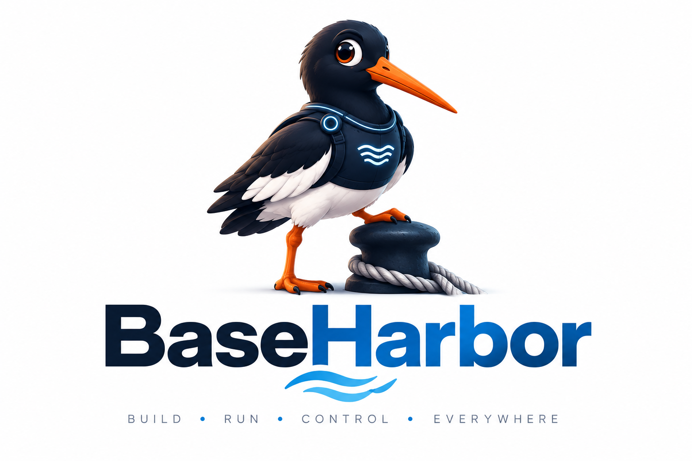

---
hide:
  - toc
---



# Deine Anwendungen. Deine Infrastruktur.

BaseHarbor verbindet Anwendungen und ihre Backends auf verifizierten Linux-Targets. Mit einer CLI betreibst du native Workloads, verbindest sichere Provider-Bindings und prüfst das Ergebnis.

[Jetzt starten](tutorials/getting-started.md){ .md-button .md-button--primary }
[GitHub](https://github.com/mcpdev80/baseharbor){ .md-button }

## Vom Repository zur laufenden Anwendung

Installiere die [CLI und eine Rootless-Docker- oder Podman-Runtime](tutorials/getting-started.md) und öffne das Repository deiner Anwendung:

```bash
baha init
baha up
baha status
```

`baha init` übernimmt das Repository und verwendet einen vorhandenen Core oder führt durch die benötigte Einrichtung. Core bedeutet **SQL + Secrets + Identity**; die Console ist optional. `baha up` gleicht die Anwendung ab. Status unterscheidet verifizierte Readiness von einem lediglich laufenden Workload.

## Mit deinen gewohnten Werkzeugen entwickeln

Anwendungscode und Bibliotheken bleiben erhalten. BaseHarbor erkennt unterstützte Compose-, Quadlet- und Kubernetes-Workload-Quellen, löst providerneutrale Anforderungen auf und liefert geschützte Bindings. Mehrdeutige oder [nicht unterstützte Quellen](explanation/workload-sources.md) erfordern vor dem Deployment eine konkrete nächste Aktion.

## Mit gemeinsamem oder isoliertem Core betreiben

Wähle eine unterstützte Provider-Platzierung und ein verwaltetes lokales oder registriertes Remote-Target. Ownership, TLS, Berechtigungen und erhaltene Daten bleiben im gesamten Lifecycle ausdrücklich geprüft. Die [Core-Ressourcenbeobachtungen](explanation/core-resources.md) unterscheiden gemessene Referenz-Topologien von Planungsbudgets und dem zusätzlichen Verbrauch durch Isolation.

## Kontrollieren und verifizieren

Prüfe vor Änderungen den Plan, diagnostiziere Fehler mit Doctor und kontrolliere Backups vor einer Recovery. CLI, JSON und MCP verwenden dieselben Domänenoperationen. [EN und DE](https://mcpdev80.github.io/baseharbor/) haben gleichwertige Seiten- und Befehlsabdeckung; ausgelieferte technische Bezeichner und verifizierte CLI-Ausgaben bleiben identisch.

## Wähle deine nächste Aufgabe

| Aufgabe | Einstieg |
| --- | --- |
| Eine Anwendung erstellen, übernehmen oder betreiben | [Applications](cli/applications.md) |
| Ein lokales oder entferntes Deployment-Ziel wählen | [Targets](cli/targets.md) |
| Verwaltete oder externe Backends anbinden | [Provider](explanation/providers.md) |
| Identity, TLS und Trust verwalten | [Sicherheit](explanation/security.md) |
| Über JSON und MCP automatisieren | [Automation und Agents](cli/automation-agents.md) |
| Ausgelieferte Befehle und Verträge nachschlagen | [Befehlsindex](cli/command-index.md) · [Referenz](reference/cli.md) |

Ausgelieferte Änderungen und Support-Grenzen stehen in den [Release Notes](releases/index.md).
